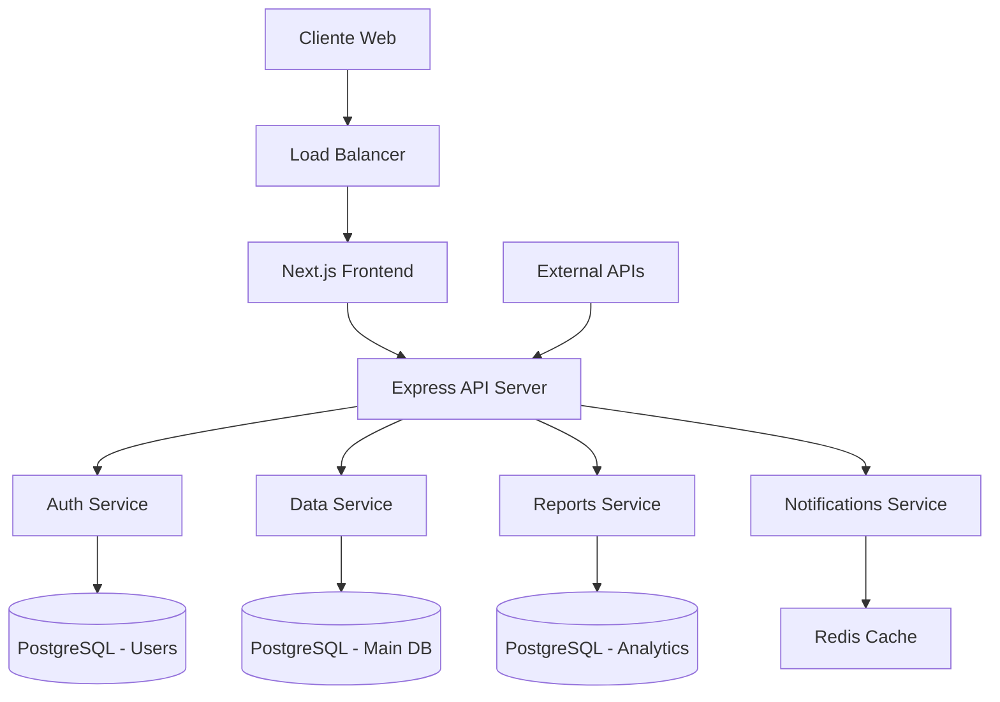

# Documento de Diseño - Sistema de Gestión #040

## Visión General

El Sistema de Gestión #040 será desarrollado como una aplicación web moderna utilizando una arquitectura de microservicios con frontend y backend separados. El sistema proporcionará una interfaz intuitiva para la gestión de datos, usuarios y procesos, con capacidades avanzadas de reportes y análisis.

## Arquitectura

### Arquitectura General



### Tecnologías Seleccionadas

**Frontend:**

- Framework: Next.js con TypeScript
- Styling: Tailwind CSS
- UI Components: Headless UI o Radix UI
- Estado: Zustand o Redux Toolkit
- Gráficos: Chart.js o Recharts

**Backend:**

- Framework: Node.js con Express y TypeScript
- ORM: Prisma
- Validación: Zod
- Documentación API: Swagger/OpenAPI

**Base de Datos:**

- Principal: PostgreSQL
- Cache: Redis
- Búsqueda: Elasticsearch (opcional)

**Infraestructura:**

- Contenedores: Docker
- Orquestación: Docker Compose (desarrollo) / Kubernetes (producción)
- Proxy Reverso: Nginx
- Monitoreo: Prometheus + Grafana

## Componentes e Interfaces

### 1. Módulo de Autenticación y Autorización

**Componentes:**

- `AuthService`: Manejo de login/logout
- `TokenManager`: Gestión de JWT tokens
- `RoleManager`: Control de roles y permisos
- `PasswordService`: Encriptación y validación

**Interfaces:**

```typescript
interface User {
  id: string;
  email: string;
  firstName: string;
  lastName: string;
  role: UserRole;
  isActive: boolean;
  createdAt: Date;
  updatedAt: Date;
}

interface AuthResponse {
  user: User;
  accessToken: string;
  refreshToken: string;
  expiresIn: number;
}
```

### 2. Dashboard y Panel de Control

**Componentes:**

- `DashboardContainer`: Contenedor principal
- `WidgetManager`: Gestión de widgets personalizables
- `MetricsService`: Cálculo de métricas en tiempo real
- `NotificationCenter`: Centro de notificaciones

**Interfaces:**

```typescript
interface DashboardWidget {
  id: string;
  type: WidgetType;
  title: string;
  config: WidgetConfig;
  position: { x: number; y: number; w: number; h: number };
}

interface DashboardMetrics {
  totalUsers: number;
  activeRecords: number;
  recentActivity: ActivityItem[];
  systemHealth: HealthStatus;
}
```

### 3. Gestión de Datos

**Componentes:**

- `DataRepository`: Acceso a datos con patrón Repository
- `ValidationService`: Validación de datos de entrada
- `AuditService`: Registro de cambios
- `SearchService`: Búsqueda y filtrado avanzado

**Interfaces:**

```typescript
interface DataRecord {
  id: string;
  type: string;
  data: Record<string, any>;
  metadata: RecordMetadata;
  createdBy: string;
  updatedBy: string;
  createdAt: Date;
  updatedAt: Date;
}

interface SearchCriteria {
  query?: string;
  filters: Record<string, any>;
  sortBy?: string;
  sortOrder?: 'asc' | 'desc';
  page: number;
  limit: number;
}
```

### 4. Sistema de Reportes

**Componentes:**

- `ReportGenerator`: Generación de reportes
- `TemplateEngine`: Motor de plantillas
- `ExportService`: Exportación a PDF/Excel
- `SchedulerService`: Reportes programados

**Interfaces:**

```typescript
interface ReportTemplate {
  id: string;
  name: string;
  description: string;
  query: string;
  parameters: ReportParameter[];
  format: ReportFormat;
}

interface ReportRequest {
  templateId: string;
  parameters: Record<string, any>;
  format: 'pdf' | 'excel' | 'csv';
  deliveryMethod: 'download' | 'email';
}
```

## Modelos de Datos

### Esquema de Base de Datos Principal

```sql
-- Tabla de Usuarios
CREATE TABLE users (
    id UUID PRIMARY KEY DEFAULT gen_random_uuid(),
    email VARCHAR(255) UNIQUE NOT NULL,
    password_hash VARCHAR(255) NOT NULL,
    first_name VARCHAR(100) NOT NULL,
    last_name VARCHAR(100) NOT NULL,
    role VARCHAR(50) NOT NULL,
    is_active BOOLEAN DEFAULT true,
    created_at TIMESTAMP DEFAULT CURRENT_TIMESTAMP,
    updated_at TIMESTAMP DEFAULT CURRENT_TIMESTAMP
);

-- Tabla de Registros de Datos
CREATE TABLE data_records (
    id UUID PRIMARY KEY DEFAULT gen_random_uuid(),
    type VARCHAR(100) NOT NULL,
    data JSONB NOT NULL,
    metadata JSONB,
    created_by UUID REFERENCES users(id),
    updated_by UUID REFERENCES users(id),
    created_at TIMESTAMP DEFAULT CURRENT_TIMESTAMP,
    updated_at TIMESTAMP DEFAULT CURRENT_TIMESTAMP
);

-- Tabla de Auditoría
CREATE TABLE audit_logs (
    id UUID PRIMARY KEY DEFAULT gen_random_uuid(),
    user_id UUID REFERENCES users(id),
    action VARCHAR(100) NOT NULL,
    resource_type VARCHAR(100) NOT NULL,
    resource_id UUID,
    old_values JSONB,
    new_values JSONB,
    ip_address INET,
    user_agent TEXT,
    created_at TIMESTAMP DEFAULT CURRENT_TIMESTAMP
);

-- Tabla de Reportes
CREATE TABLE reports (
    id UUID PRIMARY KEY DEFAULT gen_random_uuid(),
    name VARCHAR(255) NOT NULL,
    description TEXT,
    template JSONB NOT NULL,
    created_by UUID REFERENCES users(id),
    is_active BOOLEAN DEFAULT true,
    created_at TIMESTAMP DEFAULT CURRENT_TIMESTAMP,
    updated_at TIMESTAMP DEFAULT CURRENT_TIMESTAMP
);
```

## Manejo de Errores

### Estrategia de Manejo de Errores

1. **Errores de Validación**: Códigos 400 con detalles específicos
2. **Errores de Autenticación**: Códigos 401 con redirección a login
3. **Errores de Autorización**: Códigos 403 con mensaje explicativo
4. **Errores de Recursos**: Códigos 404 con sugerencias
5. **Errores del Servidor**: Códigos 500 con logging detallado

### Estructura de Respuesta de Error

```typescript
interface ErrorResponse {
  error: {
    code: string;
    message: string;
    details?: Record<string, any>;
    timestamp: string;
    requestId: string;
  };
}
```

## Estrategia de Testing

### Niveles de Testing

1. **Unit Tests**: Jest para lógica de negocio
2. **Integration Tests**: Supertest para APIs
3. **E2E Tests**: Cypress para flujos completos
4. **Performance Tests**: Artillery para carga

### Cobertura Objetivo

- Cobertura de código: mínimo 80%
- Cobertura de funcionalidades críticas: 100%
- Tests automatizados en CI/CD pipeline

### Estructura de Tests

```
tests/
├── unit/
│   ├── services/
│   ├── controllers/
│   └── utils/
├── integration/
│   ├── api/
│   └── database/
├── e2e/
│   ├── auth/
│   ├── dashboard/
│   └── reports/
└── performance/
    ├── load/
    └── stress/
```

## Consideraciones de Seguridad

### Medidas de Seguridad Implementadas

1. **Autenticación**: JWT con refresh tokens
2. **Autorización**: RBAC (Role-Based Access Control)
3. **Encriptación**: Bcrypt para passwords, HTTPS para comunicación
4. **Validación**: Sanitización de inputs, validación de esquemas
5. **Auditoría**: Logging completo de actividades
6. **Rate Limiting**: Prevención de ataques de fuerza bruta
7. **CORS**: Configuración restrictiva de orígenes permitidos

### Compliance y Regulaciones

- Cumplimiento con GDPR para protección de datos
- Implementación de políticas de retención de datos
- Capacidades de exportación y eliminación de datos personales

## Consideraciones de Performance

### Optimizaciones Planificadas

1. **Base de Datos**: Índices optimizados, consultas eficientes
2. **Caching**: Redis para datos frecuentemente accedidos
3. **Frontend**: Code splitting, lazy loading
4. **APIs**: Paginación, compresión gzip
5. **Imágenes**: Optimización y CDN

### Métricas de Performance Objetivo

- Tiempo de carga inicial: < 3 segundos
- Tiempo de respuesta API: < 500ms (95th percentile)
- Disponibilidad: 99.9% uptime
- Capacidad: 1000 usuarios concurrentes
