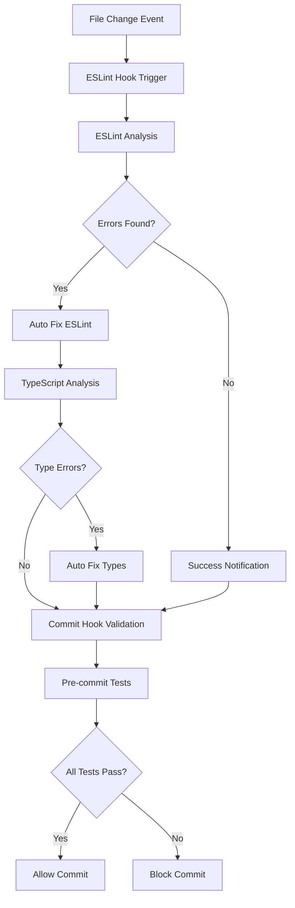

# Design Document - Code Quality Fixes

## Overview

Este sistema implementa un control de calidad de código automatizado que detecta y corrige errores de ESLint, TypeScript y problemas de tipos en tiempo real. El sistema incluye hooks de pre-commit, validación continua y herramientas de corrección automática.

## Architecture

### General Architecture



### Hook System Architecture


## Components and Interfaces

### 1. ESLint Auto-Fix Hook

**Trigger:** File creation or modification
**Patterns:** `**/*.ts`, `**/*.tsx`, `**/*.js`, `**/*.jsx`
**Actions:**
- Execute `eslint --fix` on modified files
- Run TypeScript compiler check
- Generate error reports
- Show notifications

### 2. Pre-commit Hook Integration

**Components:**
- Husky pre-commit hook
- ESLint validation
- TypeScript type checking
- Test execution
- Build verification

### 3. Type Fixing Utilities

**Functions:**
- `fixReturnTypes()`: Add explicit return types to functions
- `replaceAnyTypes()`: Replace `any` with specific types
- `generateTypeDefinitions()`: Create missing type definitions
- `validateTypeUsage()`: Check for type safety violations

### 4. Reporting System

**Features:**
- Error summary reports
- Fix suggestions
- Progress tracking
- Integration with IDE notifications

## Data Models

### Hook Configuration

```typescript
interface ESLintHookConfig {
  enabled: boolean;
  name: string;
  description: string;
  version: string;
  when: {
    type: 'fileChanged' | 'fileCreated';
    patterns: string[];
  };
  then: {
    type: 'askAgent';
    prompt: string;
  };
}
```

### Error Report

```typescript
interface CodeQualityReport {
  file: string;
  errors: {
    type: 'eslint' | 'typescript' | 'test';
    rule: string;
    message: string;
    line: number;
    column: number;
    fixable: boolean;
  }[];
  fixes: {
    type: string;
    description: string;
    applied: boolean;
  }[];
  timestamp: Date;
}
```

## Error Handling

### ESLint Errors
- Capture all ESLint rule violations
- Attempt automatic fixes using `--fix` flag
- Report unfixable errors with suggestions
- Maintain error history for tracking

### TypeScript Errors
- Detect missing return types
- Identify `any` type usage
- Check for type safety violations
- Generate type definitions where possible

### Build/Test Failures
- Run tests after fixes
- Verify build still works
- Rollback changes if tests fail
- Report integration issues

## Testing Strategy

### Unit Tests
- Test individual fix functions
- Validate error detection logic
- Check report generation
- Mock file system operations

### Integration Tests
- Test complete hook workflow
- Verify ESLint integration
- Check TypeScript compiler integration
- Test pre-commit hook behavior

### End-to-End Tests
- Simulate file changes
- Verify automatic fixes
- Test commit blocking
- Validate user notifications

### Test Coverage Requirements
- Minimum 80% code coverage
- All error paths tested
- Hook trigger scenarios covered
- Fix function validation complete
