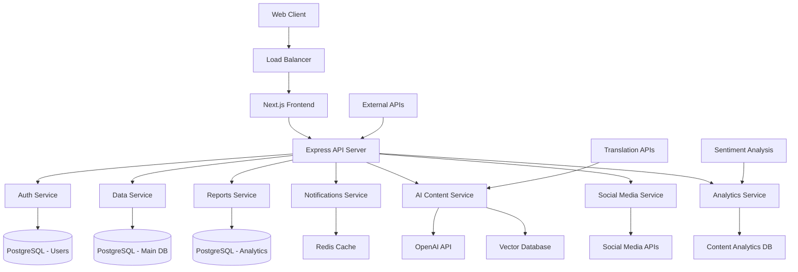
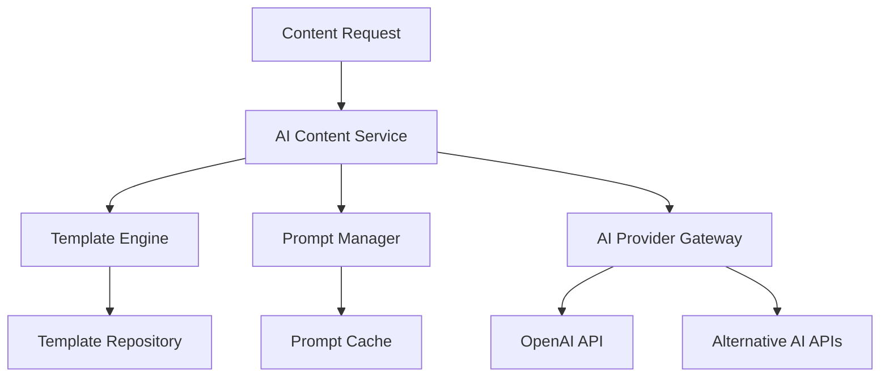
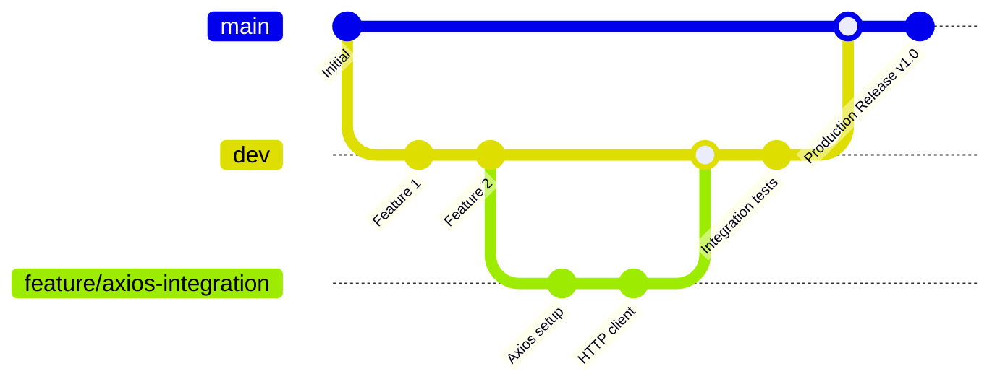
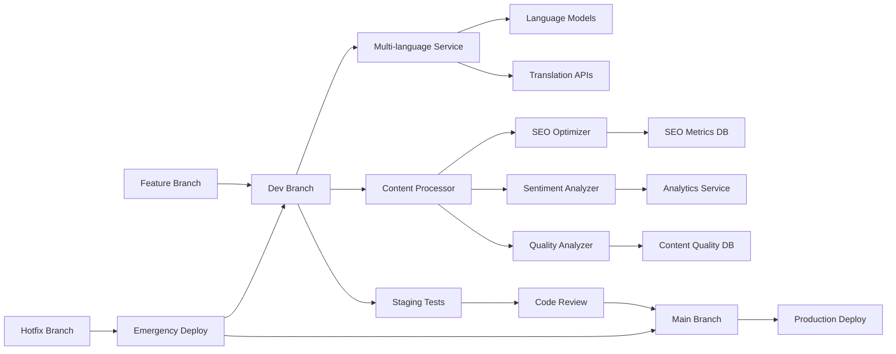

# Design Document - Sistema de Gestión #040

## Overview

Management System #040 will be developed as a modern web application using a microservices architecture with separate frontend and backend. The system will provide an intuitive interface for data, user, and process management, with advanced reporting and analysis capabilities, enhanced by AI-powered content generation and multi-platform publishing features.

## Architecture

### General Architecture



### AI Content Generation Architecture



### Development and Deployment Architecture

#### Branching Strategy



#### Branch Management Rules

- **main**: Production-ready code, always stable and deployable
  - **CRÍTICO**: NO incluye archivos de agentes, bots o herramientas de desarrollo
  - **CRÍTICO**: Sistema de IA y Telegram bot EXCLUIDOS de producción
- **dev**: Integration branch for development, staging environment
  - **Incluye**: Sistema completo de IA, bots, agentes y herramientas de desarrollo
  - **Incluye**: GitHub Actions para procesamiento automático de IA
- **feature/**: Individual features, created from dev, merged back to dev
  - **Pueden incluir**: Herramientas de desarrollo y agentes según necesidad
- **hotfix/**: Emergency fixes, created from main, merged to both main and dev
  - **NO incluyen**: Herramientas de desarrollo, solo fixes críticos

#### Deployment Pipeline



### Selected Technologies

**Frontend:**

- Framework: Next.js with TypeScript
- Styling: Tailwind CSS
- UI Components: Headless UI or Radix UI
- State Management: Zustand or Redux Toolkit
- Charts: Chart.js or Recharts

**Backend:**

- Framework: Node.js with Express and TypeScript
- ORM: Prisma
- Validation: Zod
- API Documentation: Swagger/OpenAPI

**AI & Content Generation:**

- AI Provider: OpenAI GPT-4/GPT-3.5-turbo
- Vector Database: Pinecone or Weaviate
- Translation: Google Translate API, DeepL API
- Sentiment Analysis: Natural Language API
- Content Analytics: Custom NLP pipeline

**Database:**

- Primary: PostgreSQL
- Cache: Redis
- Search: Elasticsearch (optional)
- Vector Storage: Pinecone/Weaviate

**Social Media Integration:**

- Facebook Graph API
- Twitter API v2
- Instagram Basic Display API
- LinkedIn API
- Buffer/Hootsuite APIs (alternative)

**Infrastructure:**

- Containers: Docker
- Orchestration: Docker Compose (development) / Kubernetes (production)
- Reverse Proxy: Nginx
- Monitoring: Prometheus + Grafana
- Queue System: Bull Queue with Redis

**Project Management Integration:**

- GitHub Issues: Task and feature tracking
- GitHub Projects: Kanban board for workflow management
- GitHub Actions: CI/CD pipeline automation
- GitHub API: Automated issue creation and management

## Components and Interfaces

### 1. Authentication and Authorization Module

**Componentes:**

- `AuthService`: Manejo de login/logout
- `TokenManager`: Gestión de JWT tokens
- `RoleManager`: Control de roles y permisos
- `PasswordService`: Encriptación y validación

**Interfaces:**

```typescript
interface User {
  id: string;
  email: string;
  firstName: string;
  lastName: string;
  role: UserRole;
  isActive: boolean;
  createdAt: Date;
  updatedAt: Date;
}

interface AuthResponse {
  user: User;
  accessToken: string;
  refreshToken: string;
  expiresIn: number;
}
```

### 2. Dashboard y Panel de Control

**Componentes:**

- `DashboardContainer`: Contenedor principal
- `WidgetManager`: Gestión de widgets personalizables
- `MetricsService`: Cálculo de métricas en tiempo real
- `NotificationCenter`: Centro de notificaciones

**Interfaces:**

```typescript
interface DashboardWidget {
  id: string;
  type: WidgetType;
  title: string;
  config: WidgetConfig;
  position: { x: number; y: number; w: number; h: number };
}

interface DashboardMetrics {
  totalUsers: number;
  activeRecords: number;
  recentActivity: ActivityItem[];
  systemHealth: HealthStatus;
}
```

### 3. Gestión de Datos

**Componentes:**

- `DataRepository`: Acceso a datos con patrón Repository
- `ValidationService`: Validación de datos de entrada
- `AuditService`: Registro de cambios
- `SearchService`: Búsqueda y filtrado avanzado

**Interfaces:**

```typescript
interface DataRecord {
  id: string;
  type: string;
  data: Record<string, any>;
  metadata: RecordMetadata;
  createdBy: string;
  updatedBy: string;
  createdAt: Date;
  updatedAt: Date;
}

interface SearchCriteria {
  query?: string;
  filters: Record<string, any>;
  sortBy?: string;
  sortOrder?: 'asc' | 'desc';
  page: number;
  limit: number;
}
```

### 4. Reports System

**Components:**

- `ReportGenerator`: Report generation
- `TemplateEngine`: Template engine
- `ExportService`: PDF/Excel export
- `SchedulerService`: Scheduled reports

**Interfaces:**

```typescript
interface ReportTemplate {
  id: string;
  name: string;
  description: string;
  query: string;
  parameters: ReportParameter[];
  format: ReportFormat;
}

interface ReportRequest {
  templateId: string;
  parameters: Record<string, any>;
  format: 'pdf' | 'excel' | 'csv';
  deliveryMethod: 'download' | 'email';
}
```

### 5. AI Content Generation System

**Components:**

- `AIContentService`: Main AI content orchestrator
- `TemplateManager`: Content template management
- `PromptEngine`: Dynamic prompt generation
- `ContentProcessor`: Post-generation content processing
- `QualityAnalyzer`: Content quality assessment
- `SentimentAnalyzer`: Sentiment analysis
- `SEOOptimizer`: SEO optimization

**Interfaces:**

```typescript
interface ContentTemplate {
  id: string;
  name: string;
  category: ContentCategory;
  platform: Platform[];
  promptTemplate: string;
  parameters: TemplateParameter[];
  tone: ContentTone;
  language: string;
  createdAt: Date;
  updatedAt: Date;
}

interface ContentGenerationRequest {
  templateId: string;
  parameters: Record<string, any>;
  targetPlatforms: Platform[];
  tone: ContentTone;
  language: string;
  maxLength?: number;
  keywords?: string[];
}

interface GeneratedContent {
  id: string;
  content: string;
  platform: Platform;
  qualityScore: number;
  sentimentScore: SentimentScore;
  seoScore: SEOMetrics;
  readabilityScore: number;
  suggestions: ContentSuggestion[];
  createdAt: Date;
}

interface ContentSuggestion {
  type: 'grammar' | 'style' | 'seo' | 'engagement';
  message: string;
  severity: 'low' | 'medium' | 'high';
  suggestion: string;
}

type ContentCategory = 'social_media' | 'blog' | 'email' | 'product_description' | 'biography' | 'marketing';
type Platform = 'facebook' | 'twitter' | 'instagram' | 'linkedin' | 'blog' | 'email';
type ContentTone = 'professional' | 'casual' | 'friendly' | 'formal' | 'creative' | 'persuasive';
```

### 6. Multi-Platform Publishing System

**Components:**

- `SocialMediaService`: Social media integration orchestrator
- `PlatformAdapterFactory`: Platform-specific adapters
- `SchedulingService`: Content scheduling
- `PublishingQueue`: Asynchronous publishing queue
- `DeliveryTracker`: Publishing status tracking

**Interfaces:**

```typescript
interface SocialMediaAccount {
  id: string;
  platform: Platform;
  accountId: string;
  accountName: string;
  accessToken: string;
  refreshToken?: string;
  isActive: boolean;
  permissions: string[];
  connectedAt: Date;
}

interface ScheduledPost {
  id: string;
  contentId: string;
  accounts: string[];
  scheduledFor: Date;
  status: PostStatus;
  platformSpecificContent: Record<Platform, string>;
  mediaAttachments?: MediaAttachment[];
  publishingResults?: PublishingResult[];
  createdAt: Date;
}

interface PublishingResult {
  platform: Platform;
  accountId: string;
  status: 'success' | 'failed' | 'pending';
  platformPostId?: string;
  error?: string;
  publishedAt?: Date;
}

type PostStatus = 'scheduled' | 'publishing' | 'published' | 'failed' | 'cancelled';
```

### 7. Content Analytics and Learning System

**Components:**

- `ContentAnalyticsService`: Performance tracking
- `LearningEngine`: ML-based content optimization
- `FeedbackProcessor`: User feedback processing
- `PerformanceTracker`: Content performance metrics
- `RecommendationEngine`: Content suggestions

**Interfaces:**

```typescript
interface ContentPerformance {
  contentId: string;
  platform: Platform;
  metrics: PlatformMetrics;
  engagement: EngagementMetrics;
  reach: ReachMetrics;
  conversions?: ConversionMetrics;
  analyzedAt: Date;
}

interface PlatformMetrics {
  likes: number;
  shares: number;
  comments: number;
  clicks: number;
  impressions: number;
  reach: number;
}

interface ContentRecommendation {
  type: 'template' | 'tone' | 'timing' | 'platform' | 'keywords';
  recommendation: string;
  confidence: number;
  basedOn: string[];
  expectedImprovement: number;
}
```

### 8. Multi-Language Support System

**Components:**

- `TranslationService`: Content translation orchestrator
- `LanguageDetector`: Automatic language detection
- `CulturalAdapter`: Cultural context adaptation
- `LocalizationEngine`: Content localization

**Interfaces:**

```typescript
interface TranslationRequest {
  content: string;
  sourceLanguage: string;
  targetLanguages: string[];
  platform: Platform;
  tone: ContentTone;
  culturalAdaptation: boolean;
}

interface TranslatedContent {
  language: string;
  content: string;
  confidence: number;
  culturalAdaptations: CulturalAdaptation[];
  qualityScore: number;
}

interface CulturalAdaptation {
  type: 'currency' | 'date_format' | 'cultural_reference' | 'tone_adjustment';
  original: string;
  adapted: string;
  reason: string;
}
```

## Data Models

### Main Database Schema

```sql
-- Users Table
CREATE TABLE users (
    id UUID PRIMARY KEY DEFAULT gen_random_uuid(),
    email VARCHAR(255) UNIQUE NOT NULL,
    password_hash VARCHAR(255) NOT NULL,
    first_name VARCHAR(100) NOT NULL,
    last_name VARCHAR(100) NOT NULL,
    role VARCHAR(50) NOT NULL,
    is_active BOOLEAN DEFAULT true,
    created_at TIMESTAMP DEFAULT CURRENT_TIMESTAMP,
    updated_at TIMESTAMP DEFAULT CURRENT_TIMESTAMP
);

-- Data Records Table
CREATE TABLE data_records (
    id UUID PRIMARY KEY DEFAULT gen_random_uuid(),
    type VARCHAR(100) NOT NULL,
    data JSONB NOT NULL,
    metadata JSONB,
    created_by UUID REFERENCES users(id),
    updated_by UUID REFERENCES users(id),
    created_at TIMESTAMP DEFAULT CURRENT_TIMESTAMP,
    updated_at TIMESTAMP DEFAULT CURRENT_TIMESTAMP
);

-- Audit Logs Table
CREATE TABLE audit_logs (
    id UUID PRIMARY KEY DEFAULT gen_random_uuid(),
    user_id UUID REFERENCES users(id),
    action VARCHAR(100) NOT NULL,
    resource_type VARCHAR(100) NOT NULL,
    resource_id UUID,
    old_values JSONB,
    new_values JSONB,
    ip_address INET,
    user_agent TEXT,
    created_at TIMESTAMP DEFAULT CURRENT_TIMESTAMP
);

-- Reports Table
CREATE TABLE reports (
    id UUID PRIMARY KEY DEFAULT gen_random_uuid(),
    name VARCHAR(255) NOT NULL,
    description TEXT,
    template JSONB NOT NULL,
    created_by UUID REFERENCES users(id),
    is_active BOOLEAN DEFAULT true,
    created_at TIMESTAMP DEFAULT CURRENT_TIMESTAMP,
    updated_at TIMESTAMP DEFAULT CURRENT_TIMESTAMP
);

-- AI Content Generation Tables

-- Content Templates Table
CREATE TABLE content_templates (
    id UUID PRIMARY KEY DEFAULT gen_random_uuid(),
    name VARCHAR(255) NOT NULL,
    category VARCHAR(100) NOT NULL,
    platforms TEXT[] NOT NULL,
    prompt_template TEXT NOT NULL,
    parameters JSONB NOT NULL,
    tone VARCHAR(50) NOT NULL,
    language VARCHAR(10) NOT NULL,
    is_active BOOLEAN DEFAULT true,
    created_by UUID REFERENCES users(id),
    created_at TIMESTAMP DEFAULT CURRENT_TIMESTAMP,
    updated_at TIMESTAMP DEFAULT CURRENT_TIMESTAMP
);

-- Generated Content Table
CREATE TABLE generated_content (
    id UUID PRIMARY KEY DEFAULT gen_random_uuid(),
    template_id UUID REFERENCES content_templates(id),
    content TEXT NOT NULL,
    platform VARCHAR(50) NOT NULL,
    language VARCHAR(10) NOT NULL,
    tone VARCHAR(50) NOT NULL,
    quality_score DECIMAL(3,2),
    sentiment_score JSONB,
    seo_score JSONB,
    readability_score DECIMAL(3,2),
    suggestions JSONB,
    parameters JSONB,
    created_by UUID REFERENCES users(id),
    created_at TIMESTAMP DEFAULT CURRENT_TIMESTAMP
);

-- Social Media Accounts Table
CREATE TABLE social_media_accounts (
    id UUID PRIMARY KEY DEFAULT gen_random_uuid(),
    user_id UUID REFERENCES users(id),
    platform VARCHAR(50) NOT NULL,
    account_id VARCHAR(255) NOT NULL,
    account_name VARCHAR(255) NOT NULL,
    access_token TEXT NOT NULL,
    refresh_token TEXT,
    permissions TEXT[],
    is_active BOOLEAN DEFAULT true,
    connected_at TIMESTAMP DEFAULT CURRENT_TIMESTAMP,
    updated_at TIMESTAMP DEFAULT CURRENT_TIMESTAMP
);

-- Scheduled Posts Table
CREATE TABLE scheduled_posts (
    id UUID PRIMARY KEY DEFAULT gen_random_uuid(),
    content_id UUID REFERENCES generated_content(id),
    account_ids UUID[] NOT NULL,
    scheduled_for TIMESTAMP NOT NULL,
    status VARCHAR(50) DEFAULT 'scheduled',
    platform_specific_content JSONB,
    media_attachments JSONB,
    created_by UUID REFERENCES users(id),
    created_at TIMESTAMP DEFAULT CURRENT_TIMESTAMP,
    updated_at TIMESTAMP DEFAULT CURRENT_TIMESTAMP
);

-- Publishing Results Table
CREATE TABLE publishing_results (
    id UUID PRIMARY KEY DEFAULT gen_random_uuid(),
    scheduled_post_id UUID REFERENCES scheduled_posts(id),
    account_id UUID REFERENCES social_media_accounts(id),
    platform VARCHAR(50) NOT NULL,
    status VARCHAR(50) NOT NULL,
    platform_post_id VARCHAR(255),
    error_message TEXT,
    published_at TIMESTAMP,
    created_at TIMESTAMP DEFAULT CURRENT_TIMESTAMP
);

-- Content Performance Table
CREATE TABLE content_performance (
    id UUID PRIMARY KEY DEFAULT gen_random_uuid(),
    content_id UUID REFERENCES generated_content(id),
    platform VARCHAR(50) NOT NULL,
    platform_post_id VARCHAR(255),
    metrics JSONB NOT NULL,
    engagement JSONB,
    reach JSONB,
    conversions JSONB,
    analyzed_at TIMESTAMP DEFAULT CURRENT_TIMESTAMP
);

-- Content Feedback Table
CREATE TABLE content_feedback (
    id UUID PRIMARY KEY DEFAULT gen_random_uuid(),
    content_id UUID REFERENCES generated_content(id),
    user_id UUID REFERENCES users(id),
    feedback_type VARCHAR(50) NOT NULL,
    rating INTEGER CHECK (rating >= 1 AND rating <= 5),
    comments TEXT,
    created_at TIMESTAMP DEFAULT CURRENT_TIMESTAMP
);

-- Translation Cache Table
CREATE TABLE translation_cache (
    id UUID PRIMARY KEY DEFAULT gen_random_uuid(),
    source_content_hash VARCHAR(64) NOT NULL,
    source_language VARCHAR(10) NOT NULL,
    target_language VARCHAR(10) NOT NULL,
    translated_content TEXT NOT NULL,
    confidence DECIMAL(3,2),
    cultural_adaptations JSONB,
    provider VARCHAR(50) NOT NULL,
    created_at TIMESTAMP DEFAULT CURRENT_TIMESTAMP,
    UNIQUE(source_content_hash, source_language, target_language)
);

-- Content Analytics Summary Table
CREATE TABLE content_analytics_summary (
    id UUID PRIMARY KEY DEFAULT gen_random_uuid(),
    user_id UUID REFERENCES users(id),
    period_start DATE NOT NULL,
    period_end DATE NOT NULL,
    total_content_generated INTEGER DEFAULT 0,
    total_posts_published INTEGER DEFAULT 0,
    avg_quality_score DECIMAL(3,2),
    avg_engagement_rate DECIMAL(5,4),
    top_performing_platforms TEXT[],
    recommendations JSONB,
    created_at TIMESTAMP DEFAULT CURRENT_TIMESTAMP,
    UNIQUE(user_id, period_start, period_end)
);

-- Indexes for Performance
CREATE INDEX idx_generated_content_created_by ON generated_content(created_by);
CREATE INDEX idx_generated_content_template_id ON generated_content(template_id);
CREATE INDEX idx_generated_content_platform ON generated_content(platform);
CREATE INDEX idx_scheduled_posts_scheduled_for ON scheduled_posts(scheduled_for);
CREATE INDEX idx_scheduled_posts_status ON scheduled_posts(status);
CREATE INDEX idx_content_performance_content_id ON content_performance(content_id);
CREATE INDEX idx_content_performance_platform ON content_performance(platform);
CREATE INDEX idx_social_media_accounts_user_id ON social_media_accounts(user_id);
CREATE INDEX idx_social_media_accounts_platform ON social_media_accounts(platform);
```

## Error Handling

### Error Handling Strategy

1. **Validation Errors**: 400 codes with specific details
2. **Authentication Errors**: 401 codes with login redirection
3. **Authorization Errors**: 403 codes with explanatory message
4. **Resource Errors**: 404 codes with suggestions
5. **Server Errors**: 500 codes with detailed logging
6. **AI Service Errors**: Custom handling for AI provider failures
7. **Social Media API Errors**: Platform-specific error handling

### Error Response Structure

```typescript
interface ErrorResponse {
  error: {
    code: string;
    message: string;
    details?: Record<string, any>;
    timestamp: string;
    requestId: string;
    aiProvider?: string; // For AI-related errors
    platform?: string; // For social media errors
  };
}

interface AIServiceError {
  provider: 'openai' | 'deepl' | 'google';
  errorType: 'rate_limit' | 'quota_exceeded' | 'invalid_request' | 'service_unavailable';
  originalError: string;
  retryAfter?: number;
  fallbackAvailable: boolean;
}
```

## Testing Strategy

### Testing Levels

1. **Unit Tests**: Jest for business logic
2. **Integration Tests**: Supertest for APIs
3. **E2E Tests**: Cypress for complete flows
4. **Performance Tests**: Artillery for load testing
5. **AI Service Tests**: Mock AI providers for consistent testing
6. **Social Media API Tests**: Mock external platform APIs

### Coverage Objectives

- Code coverage: minimum 80%
- Critical functionality coverage: 100%
- Automated tests in CI/CD pipeline
- AI content generation: 95% coverage
- Social media integration: 90% coverage

### Test Structure

```
tests/
├── unit/
│   ├── services/
│   │   ├── ai-content/
│   │   ├── social-media/
│   │   └── analytics/
│   ├── controllers/
│   └── utils/
├── integration/
│   ├── api/
│   │   ├── content-generation/
│   │   ├── social-publishing/
│   │   └── analytics/
│   └── database/
├── e2e/
│   ├── auth/
│   ├── dashboard/
│   ├── content-creation/
│   ├── social-publishing/
│   └── reports/
├── performance/
│   ├── load/
│   ├── stress/
│   └── ai-service-limits/
└── mocks/
    ├── openai-responses/
    ├── social-media-apis/
    └── translation-services/
```

### AI-Specific Testing Considerations

```typescript
// Mock AI responses for consistent testing
interface MockAIResponse {
  content: string;
  qualityScore: number;
  processingTime: number;
  tokensUsed: number;
}

// Test AI service fallbacks
describe('AI Content Service', () => {
  it('should fallback to alternative provider when primary fails', async () => {
    // Test implementation
  });

  it('should handle rate limiting gracefully', async () => {
    // Test implementation
  });

  it('should validate content quality thresholds', async () => {
    // Test implementation
  });
});
```

## Security Considerations

### Implemented Security Measures

1. **Authentication**: JWT with refresh tokens
2. **Authorization**: RBAC (Role-Based Access Control)
3. **Encryption**: Bcrypt for passwords, HTTPS for communication
4. **Validation**: Input sanitization, schema validation
5. **Auditing**: Complete activity logging
6. **Rate Limiting**: Brute force attack prevention
7. **CORS**: Restrictive origin configuration
8. **AI Content Security**: Content filtering and validation
9. **API Key Management**: Secure storage of external API keys
10. **Social Media Token Security**: Encrypted token storage with rotation

### AI-Specific Security Measures

```typescript
interface AISecurityConfig {
  contentFiltering: {
    enabled: boolean;
    toxicityThreshold: number;
    profanityFilter: boolean;
    personalDataDetection: boolean;
  };
  rateLimiting: {
    requestsPerMinute: number;
    tokensPerDay: number;
    costLimits: {
      dailyLimit: number;
      monthlyLimit: number;
    };
  };
  dataProtection: {
    logRetention: number; // days
    anonymizeUserData: boolean;
    encryptPrompts: boolean;
  };
}
```

### Social Media Security

- OAuth 2.0 implementation for all platform integrations
- Token encryption at rest
- Automatic token refresh and rotation
- Scope limitation for minimal required permissions
- Webhook signature verification
- Rate limiting per platform API limits

### Compliance and Regulations

- GDPR compliance for data protection
- Data retention policy implementation
- Personal data export and deletion capabilities
- AI content generation audit trails
- Social media data handling compliance
- Content moderation and filtering requirements

## Development Standards and Architectural Principles

### Mandatory Code Rules and Design Principles

#### 1. Single Responsibility Principle (SRP) - CRITICAL ARCHITECTURAL CONSTRAINT

**CRITICAL RULE**: Every component, service, and module MUST follow the Single Responsibility Principle.

**Implementation Guidelines:**

```typescript
// ❌ WRONG - Component doing too many things
export function UserDashboard() {
  // User authentication logic
  // Data fetching logic
  // UI rendering logic
  // Analytics tracking logic
  // Social media posting logic
  // AI content generation logic
  // 500+ lines of mixed responsibilities
}

// ✅ CORRECT - Single responsibility per component
export function UserDashboard() {
  return (
    <DashboardLayout>
      <UserProfile />
      <ContentGenerator />
      <SocialMediaManager />
      <AnalyticsSummary />
    </DashboardLayout>
  );
}

// Each component has a single, clear responsibility
export function ContentGenerator() {
  const { generateContent } = useContentGeneration();
  // Only handles content generation UI and logic
}

export function SocialMediaManager() {
  const { publishToSocial } = useSocialMediaPublishing();
  // Only handles social media publishing UI and logic
}
```

#### 2. Component Size Limit - 300 Lines Maximum

**CRITICAL RULE**: React components CANNOT EXCEED 300 LINES of code.

**Justification:**

- Improves readability and maintainability
- Facilitates unit testing
- Promotes code reusability
- Reduces cognitive complexity
- Enforces Single Responsibility Principle

**Mandatory Modularization Process:**

When a component exceeds 300 lines, it MUST be refactored following this structure:

```typescript
// ✅ RECOMMENDED STRUCTURE

// 1. Custom hook for state logic (SRP: State Management)
export function useContentGenerationLogic() {
  // All state logic and effects for content generation
  const [templates, setTemplates] = useState([]);
  const [generatedContent, setGeneratedContent] = useState('');
  // ... other state logic
  return { templates, generatedContent, generateContent };
}

// 2. Smaller, specialized components (SRP: UI Rendering)
export function ContentTemplateSelector({ templates, onSelect }) {
  // SRP: Only handles template selection UI
}

export function ContentPreview({ content, onEdit }) {
  // SRP: Only handles content preview UI
}

export function ContentActions({ onGenerate, onSave, onPublish }) {
  // SRP: Only handles action buttons UI
}

// 3. Main component (maximum 100 lines, SRP: Composition)
export function ContentGenerator() {
  const logic = useContentGenerationLogic();

  return (
    <div className="content-generator">
      <ContentTemplateSelector templates={logic.templates} onSelect={logic.selectTemplate} />
      <ContentPreview content={logic.generatedContent} onEdit={logic.editContent} />
      <ContentActions onGenerate={logic.generateContent} onSave={logic.saveContent} onPublish={logic.publishContent} />
    </div>
  );
}
```

#### 3. Service Layer Architecture (SRP Application)

**Each service MUST have a single, well-defined responsibility:**

```typescript
// ✅ CORRECT - Single responsibility services
export class AIContentService {
  // SRP: Only handles AI content generation
  async generateContent(request: ContentGenerationRequest): Promise<GeneratedContent> {}
}

export class SocialMediaService {
  // SRP: Only handles social media publishing
  async publishToSocial(content: string, platforms: Platform[]): Promise<PublishingResult[]> {}
}

export class ContentAnalyticsService {
  // SRP: Only handles content performance analytics
  async analyzeContentPerformance(contentId: string): Promise<ContentPerformance> {}
}

export class TranslationService {
  // SRP: Only handles content translation
  async translateContent(content: string, targetLanguages: string[]): Promise<TranslatedContent[]> {}
}
```

#### 4. Modularization Structure with Barrel System (SRP-Based Organization)

**Mandatory Pattern for Complex Features:**

```
components/
├── ai-content-generation/
│   ├── hooks/
│   │   ├── use-content-generation.ts     // SRP: Content generation logic
│   │   ├── use-template-management.ts    // SRP: Template management logic
│   │   ├── use-content-analytics.ts      // SRP: Analytics logic
│   │   └── index.ts                      // Barrel export for hooks
│   ├── components/
│   │   ├── template-selector.tsx         // SRP: Template selection UI
│   │   ├── content-editor.tsx           // SRP: Content editing UI
│   │   ├── quality-analyzer.tsx         // SRP: Quality analysis UI
│   │   ├── content-preview.tsx          // SRP: Content preview UI
│   │   └── index.ts                     // Barrel export for components
│   ├── services/
│   │   ├── ai-content.service.ts        // SRP: AI API integration
│   │   ├── quality-analysis.service.ts  // SRP: Quality analysis
│   │   ├── template.service.ts          // SRP: Template management
│   │   └── index.ts                     // Barrel export for services
│   ├── helpers/
│   │   ├── content-formatters.ts        // SRP: Content formatting utilities
│   │   ├── validation-helpers.ts        // SRP: Validation utilities
│   │   ├── platform-adapters.ts         // SRP: Platform-specific adaptations
│   │   ├── text-processors.ts           // SRP: Text processing utilities
│   │   └── index.ts                     // Barrel export for helpers
│   ├── types/
│   │   ├── content-generation.types.ts  // SRP: Content generation types
│   │   ├── platform.types.ts           // SRP: Platform-specific types
│   │   ├── analytics.types.ts          // SRP: Analytics types
│   │   └── index.ts                     // Barrel export for types
│   └── index.ts                         // Main barrel export for feature
```

#### 5. Helper Functions Architecture (DRY Principle)

**CRITICAL RULE**: All reusable utility functions MUST be placed in dedicated helper modules to avoid code duplication.

**Helper Categories and Examples:**

```typescript
// helpers/content-formatters.ts
export const formatContentForPlatform = (content: string, platform: Platform): string => {
  // SRP: Only handles content formatting for specific platforms
  switch (platform) {
    case 'twitter':
      return truncateToTwitterLimit(content);
    case 'linkedin':
      return formatForLinkedIn(content);
    default:
      return content;
  }
};

export const truncateToTwitterLimit = (text: string): string => {
  // SRP: Only handles Twitter character limit truncation
  return text.length > 280 ? text.substring(0, 277) + '...' : text;
};

// helpers/validation-helpers.ts
export const validateContentQuality = (content: string): ValidationResult => {
  // SRP: Only handles content quality validation
  return {
    hasMinLength: content.length >= 10,
    hasMaxLength: content.length <= 5000,
    isNotEmpty: content.trim().length > 0,
    hasValidEncoding: isValidUTF8(content),
  };
};

export const validateSocialMediaCredentials = (credentials: SocialCredentials): boolean => {
  // SRP: Only handles social media credential validation
  return credentials.accessToken && credentials.platform && !isTokenExpired(credentials.expiresAt);
};

// helpers/text-processors.ts
export const extractHashtags = (text: string): string[] => {
  // SRP: Only handles hashtag extraction
  return text.match(/#\w+/g) || [];
};

export const extractMentions = (text: string): string[] => {
  // SRP: Only handles mention extraction
  return text.match(/@\w+/g) || [];
};

export const calculateReadabilityScore = (text: string): number => {
  // SRP: Only handles readability calculation
  const sentences = text.split(/[.!?]+/).length;
  const words = text.split(/\s+/).length;
  const syllables = countSyllables(text);

  return calculateFleschScore(sentences, words, syllables);
};

// helpers/platform-adapters.ts
export const adaptContentForInstagram = (content: string): InstagramPost => {
  // SRP: Only handles Instagram-specific adaptations
  return {
    caption: content,
    hashtags: extractHashtags(content),
    mentions: extractMentions(content),
    maxLength: 2200,
  };
};

export const adaptContentForLinkedIn = (content: string): LinkedInPost => {
  // SRP: Only handles LinkedIn-specific adaptations
  return {
    text: content,
    isProfessional: true,
    maxLength: 3000,
    suggestedTags: generateProfessionalTags(content),
  };
};
```

#### 6. Barrel Export System (Index.ts Pattern)

**CRITICAL RULE**: Every module directory MUST have an index.ts file that exports all public interfaces using the barrel pattern.

**Implementation Examples:**

```typescript
// components/ai-content-generation/hooks/index.ts
export { useContentGeneration } from './use-content-generation';
export { useTemplateManagement } from './use-template-management';
export { useContentAnalytics } from './use-content-analytics';

// components/ai-content-generation/helpers/index.ts
export * from './content-formatters';
export * from './validation-helpers';
export * from './text-processors';
export * from './platform-adapters';

// components/ai-content-generation/components/index.ts
export { TemplateSelector } from './template-selector';
export { ContentEditor } from './content-editor';
export { QualityAnalyzer } from './quality-analyzer';
export { ContentPreview } from './content-preview';

// components/ai-content-generation/services/index.ts
export { AIContentService } from './ai-content.service';
export { QualityAnalysisService } from './quality-analysis.service';
export { TemplateService } from './template.service';

// components/ai-content-generation/types/index.ts
export * from './content-generation.types';
export * from './platform.types';
export * from './analytics.types';

// Main feature barrel export
// components/ai-content-generation/index.ts
export * from './components';
export * from './hooks';
export * from './services';
export * from './helpers';
export * from './types';

// Usage examples with clean imports
import {
  useContentGeneration,
  formatContentForPlatform,
  validateContentQuality,
  ContentGenerationRequest,
} from '@/components/ai-content-generation';

// Instead of:
// import { useContentGeneration } from '@/components/ai-content-generation/hooks/use-content-generation';
// import { formatContentForPlatform } from '@/components/ai-content-generation/helpers/content-formatters';
// import { validateContentQuality } from '@/components/ai-content-generation/helpers/validation-helpers';
// import { ContentGenerationRequest } from '@/components/ai-content-generation/types/content-generation.types';
```

#### 7. Global Helpers Structure

**Project-wide helper organization:**

```
src/
├── helpers/
│   ├── api/
│   │   ├── request-helpers.ts           // SRP: API request utilities
│   │   ├── response-handlers.ts         // SRP: API response handling
│   │   ├── error-handlers.ts           // SRP: API error handling
│   │   └── index.ts                    // Barrel export
│   ├── validation/
│   │   ├── form-validators.ts          // SRP: Form validation utilities
│   │   ├── data-validators.ts          // SRP: Data validation utilities
│   │   ├── schema-validators.ts        // SRP: Schema validation utilities
│   │   └── index.ts                    // Barrel export
│   ├── formatting/
│   │   ├── date-formatters.ts          // SRP: Date formatting utilities
│   │   ├── number-formatters.ts        // SRP: Number formatting utilities
│   │   ├── text-formatters.ts          // SRP: Text formatting utilities
│   │   └── index.ts                    // Barrel export
│   ├── storage/
│   │   ├── local-storage-helpers.ts    // SRP: Local storage utilities
│   │   ├── session-storage-helpers.ts  // SRP: Session storage utilities
│   │   ├── cookie-helpers.ts           // SRP: Cookie utilities
│   │   └── index.ts                    // Barrel export
│   └── index.ts                        // Main helpers barrel export
```

#### 8. Full-Stack Architecture Application (Frontend + Backend)

**CRITICAL RULE**: All architectural principles (SRP, 300-line limit, helpers, barrel exports) apply to BOTH frontend and backend codebases.

**Frontend Structure:**

```
frontend/src/
├── components/
│   ├── ai-content-generation/
│   │   ├── components/
│   │   ├── hooks/
│   │   ├── helpers/
│   │   ├── types/
│   │   └── index.ts
│   └── index.ts
├── helpers/
│   ├── api/
│   ├── validation/
│   ├── formatting/
│   └── index.ts
├── services/
│   ├── ai-content.service.ts
│   ├── social-media.service.ts
│   └── index.ts
├── types/
│   ├── shared/                    // Shared with backend
│   ├── frontend-specific/
│   └── index.ts
└── utils/
    ├── constants/
    ├── enums/
    └── index.ts
```

**Backend Structure:**

```
backend/src/
├── controllers/
│   ├── ai-content/
│   │   ├── ai-content.controller.ts
│   │   ├── helpers/
│   │   ├── types/
│   │   └── index.ts
│   └── index.ts
├── services/
│   ├── ai-content/
│   │   ├── ai-content.service.ts
│   │   ├── helpers/
│   │   ├── types/
│   │   └── index.ts
│   └── index.ts
├── helpers/
│   ├── database/
│   ├── validation/
│   ├── formatting/
│   ├── api/
│   └── index.ts
├── types/
│   ├── shared/                    // Shared with frontend
│   ├── backend-specific/
│   └── index.ts
└── utils/
    ├── constants/
    ├── enums/
    └── index.ts
```

#### 9. Shared TypeScript Types Architecture

**CRITICAL RULE**: TypeScript interfaces and types MUST be organized in a shared structure to avoid duplication between frontend and backend.

**Shared Types Structure:**

```
shared-types/
├── api/
│   ├── requests/
│   │   ├── content-generation.types.ts
│   │   ├── social-media.types.ts
│   │   ├── user-management.types.ts
│   │   └── index.ts
│   ├── responses/
│   │   ├── content-generation.types.ts
│   │   ├── social-media.types.ts
│   │   ├── analytics.types.ts
│   │   └── index.ts
│   └── index.ts
├── entities/
│   ├── user.types.ts
│   ├── content.types.ts
│   ├── social-media.types.ts
│   ├── analytics.types.ts
│   └── index.ts
├── enums/
│   ├── platforms.enum.ts
│   ├── content-types.enum.ts
│   ├── user-roles.enum.ts
│   └── index.ts
├── constants/
│   ├── api-endpoints.ts
│   ├── platform-limits.ts
│   ├── validation-rules.ts
│   └── index.ts
└── index.ts
```

**Implementation Examples:**

```typescript
// shared-types/entities/content.types.ts
export interface ContentTemplate {
  id: string;
  name: string;
  category: ContentCategory;
  platforms: Platform[];
  promptTemplate: string;
  parameters: TemplateParameter[];
  tone: ContentTone;
  language: string;
  createdAt: Date;
  updatedAt: Date;
}

export interface GeneratedContent {
  id: string;
  templateId: string;
  content: string;
  platform: Platform;
  qualityScore: number;
  sentimentScore: SentimentScore;
  seoScore: SEOMetrics;
  readabilityScore: number;
  suggestions: ContentSuggestion[];
  createdAt: Date;
}

// shared-types/api/requests/content-generation.types.ts
export interface ContentGenerationRequest {
  templateId: string;
  parameters: Record<string, any>;
  targetPlatforms: Platform[];
  tone: ContentTone;
  language: string;
  maxLength?: number;
  keywords?: string[];
}

export interface BulkContentGenerationRequest {
  requests: ContentGenerationRequest[];
  batchId: string;
  priority: 'low' | 'normal' | 'high';
}

// shared-types/api/responses/content-generation.types.ts
export interface ContentGenerationResponse {
  success: boolean;
  data: GeneratedContent;
  metadata: {
    processingTime: number;
    tokensUsed: number;
    cost: number;
  };
}

export interface BulkContentGenerationResponse {
  success: boolean;
  batchId: string;
  results: ContentGenerationResponse[];
  summary: {
    totalRequests: number;
    successfulRequests: number;
    failedRequests: number;
    totalCost: number;
  };
}

// shared-types/enums/platforms.enum.ts
export enum Platform {
  FACEBOOK = 'facebook',
  TWITTER = 'twitter',
  INSTAGRAM = 'instagram',
  LINKEDIN = 'linkedin',
  BLOG = 'blog',
  EMAIL = 'email',
}

export enum ContentCategory {
  SOCIAL_MEDIA = 'social_media',
  BLOG = 'blog',
  EMAIL = 'email',
  PRODUCT_DESCRIPTION = 'product_description',
  BIOGRAPHY = 'biography',
  MARKETING = 'marketing',
}

// shared-types/constants/platform-limits.ts
export const PLATFORM_LIMITS = {
  [Platform.TWITTER]: {
    maxLength: 280,
    maxHashtags: 2,
    maxMentions: 10,
  },
  [Platform.FACEBOOK]: {
    maxLength: 63206,
    maxHashtags: 30,
    maxMentions: 50,
  },
  [Platform.INSTAGRAM]: {
    maxLength: 2200,
    maxHashtags: 30,
    maxMentions: 20,
  },
  [Platform.LINKEDIN]: {
    maxLength: 3000,
    maxHashtags: 3,
    maxMentions: 10,
  },
} as const;
```

**Usage in Frontend:**

```typescript
// frontend/src/services/ai-content.service.ts
import { ContentGenerationRequest, ContentGenerationResponse, Platform, PLATFORM_LIMITS } from '@shared-types';

export class AIContentService {
  async generateContent(request: ContentGenerationRequest): Promise<ContentGenerationResponse> {
    // Implementation using shared types
  }
}
```

**Usage in Backend:**

```typescript
// backend/src/controllers/ai-content.controller.ts
import { ContentGenerationRequest, ContentGenerationResponse, Platform, PLATFORM_LIMITS } from '@shared-types';

export class AIContentController {
  async generateContent(req: Request<{}, ContentGenerationResponse, ContentGenerationRequest>): Promise<void> {
    // Implementation using shared types
  }
}
```

**Package.json Configuration for Shared Types:**

```json
// package.json (both frontend and backend)
{
  "dependencies": {
    "@shared-types": "file:../shared-types"
  }
}

// shared-types/package.json
{
  "name": "@shared-types",
  "version": "1.0.0",
  "main": "index.ts",
  "types": "index.ts"
}
```

#### 10. Development Tools and Debugging Architecture

**CRITICAL RULE**: All code must be written with comprehensive debugging support and error prevention tools.

**Advanced Debugging Configuration:**

```typescript
// utils/debug/logger.ts
export enum LogLevel {
  ERROR = 0,
  WARN = 1,
  INFO = 2,
  DEBUG = 3,
}

export interface LogContext {
  component?: string;
  function?: string;
  userId?: string;
  requestId?: string;
  timestamp: Date;
}

export class Logger {
  private static instance: Logger;
  private logLevel: LogLevel = process.env.NODE_ENV === 'development' ? LogLevel.DEBUG : LogLevel.INFO;

  static getInstance(): Logger {
    if (!Logger.instance) {
      Logger.instance = new Logger();
    }
    return Logger.instance;
  }

  debug(message: string, context?: LogContext, data?: Record<string, unknown>): void {
    if (this.logLevel >= LogLevel.DEBUG) {
      console.debug(`[DEBUG] ${this.formatMessage(message, context)}`, data);
    }
  }

  info(message: string, context?: LogContext, data?: Record<string, unknown>): void {
    if (this.logLevel >= LogLevel.INFO) {
      console.info(`[INFO] ${this.formatMessage(message, context)}`, data);
    }
  }

  warn(message: string, context?: LogContext, data?: Record<string, unknown>): void {
    if (this.logLevel >= LogLevel.WARN) {
      console.warn(`[WARN] ${this.formatMessage(message, context)}`, data);
    }
  }

  error(message: string, context?: LogContext, error?: Error): void {
    console.error(`[ERROR] ${this.formatMessage(message, context)}`, {
      error: error?.message,
      stack: error?.stack,
    });
  }

  private formatMessage(message: string, context?: LogContext): string {
    const timestamp = new Date().toISOString();
    const component = context?.component ? `[${context.component}]` : '';
    const func = context?.function ? `[${context.function}]` : '';
    return `${timestamp} ${component}${func} ${message}`;
  }
}

// Custom hook for component debugging
export function useDebugLogger(componentName: string) {
  const logger = Logger.getInstance();

  return {
    debug: (message: string, data?: Record<string, unknown>) =>
      logger.debug(message, { component: componentName }, data),
    info: (message: string, data?: Record<string, unknown>) => logger.info(message, { component: componentName }, data),
    warn: (message: string, data?: Record<string, unknown>) => logger.warn(message, { component: componentName }, data),
    error: (message: string, error?: Error) => logger.error(message, { component: componentName }, error),
  };
}
```

**Real-time Error Detection and Prevention:**

```typescript
// utils/error-boundary/error-tracker.ts
export interface ErrorInfo {
  componentStack: string;
  errorBoundary?: string;
  eventId?: string;
}

export class ErrorTracker {
  static trackError(error: Error, errorInfo: ErrorInfo): void {
    // Detailed logging for development
    console.error('🚨 Component Error Detected:', {
      message: error.message,
      stack: error.stack,
      componentStack: errorInfo.componentStack,
      timestamp: new Date().toISOString(),
      userAgent: navigator.userAgent,
      url: window.location.href,
    });
  }

  static trackPerformance(componentName: string, renderTime: number): void {
    if (renderTime > 100) {
      console.warn(`⚡ Performance Warning: ${componentName} took ${renderTime}ms to render`);
    }
  }

  static trackTypeError(functionName: string, expectedType: string, receivedType: string): void {
    console.error(`🔴 Type Error in ${functionName}: Expected ${expectedType}, received ${receivedType}`);
  }
}

// Enhanced Error Boundary with detailed logging
export class DetailedErrorBoundary extends React.Component<
  {
    children: React.ReactNode;
    fallback: React.ComponentType<{ error: Error; retry: () => void }>;
    onError?: (error: Error, errorInfo: React.ErrorInfo) => void;
  },
  { hasError: boolean; error: Error | null }
> {
  constructor(props: any) {
    super(props);
    this.state = { hasError: false, error: null };
  }

  static getDerivedStateFromError(error: Error): { hasError: boolean; error: Error } {
    return { hasError: true, error };
  }

  componentDidCatch(error: Error, errorInfo: React.ErrorInfo): void {
    ErrorTracker.trackError(error, {
      componentStack: errorInfo.componentStack,
      errorBoundary: 'DetailedErrorBoundary',
    });

    this.props.onError?.(error, errorInfo);
  }

  retry = (): void => {
    this.setState({ hasError: false, error: null });
  };

  render(): React.ReactNode {
    if (this.state.hasError && this.state.error) {
      return <this.props.fallback error={this.state.error} retry={this.retry} />;
    }

    return this.props.children;
  }
}
```

#### 11. Complexity Control and Code Quality Rules

**CRITICAL RULE**: Function complexity MUST NOT exceed 8 (Cyclomatic Complexity).

**ESLint Configuration for Strict Quality:**

```json
// .eslintrc.js
{
  "extends": ["@typescript-eslint/recommended", "@typescript-eslint/recommended-requiring-type-checking"],
  "rules": {
    // Complexity Control
    "complexity": ["error", { "max": 8 }],
    "max-lines-per-function": ["error", { "max": 50 }],
    "max-depth": ["error", { "max": 4 }],
    "max-params": ["error", { "max": 4 }],

    // TypeScript Strict Rules
    "@typescript-eslint/no-explicit-any": "error",
    "@typescript-eslint/no-unsafe-any": "error",
    "@typescript-eslint/no-unsafe-assignment": "error",
    "@typescript-eslint/no-unsafe-call": "error",
    "@typescript-eslint/no-unsafe-member-access": "error",
    "@typescript-eslint/no-unsafe-return": "error",
    "@typescript-eslint/explicit-function-return-type": "error",
    "@typescript-eslint/explicit-module-boundary-types": "error",
    "@typescript-eslint/no-unused-vars": "error",
    "@typescript-eslint/prefer-nullish-coalescing": "error",
    "@typescript-eslint/prefer-optional-chain": "error",

    // General Quality Rules
    "no-alert": "error",
    "no-confirm": "error",
    "max-lines": ["error", { "max": 300, "skipComments": true }],
    "prefer-const": "error",
    "no-var": "error"
  },
  "parserOptions": {
    "project": "./tsconfig.json"
  }
}
```

**Complexity Reduction Strategies:**

```typescript
// ❌ WRONG - High complexity (11+)
function ProfilePage(): JSX.Element {
  const [user, setUser] = useState<User | null>(null);
  const [loading, setLoading] = useState<boolean>(true);
  const [editing, setEditing] = useState<boolean>(false);
  const [errors, setErrors] = useState<ValidationErrors>({});

  useEffect(() => {
    if (userId) {
      if (isAuthenticated) {
        if (hasPermission('read_profile')) {
          fetchUserProfile(userId)
            .then((userData) => {
              if (userData) {
                if (userData.isActive) {
                  setUser(userData);
                } else {
                  setErrors({ general: 'User is inactive' });
                }
              } else {
                setErrors({ general: 'User not found' });
              }
            })
            .catch((error) => {
              if (error.status === 404) {
                setErrors({ general: 'User not found' });
              } else if (error.status === 403) {
                setErrors({ general: 'Access denied' });
              } else {
                setErrors({ general: 'Failed to load profile' });
              }
            })
            .finally(() => setLoading(false));
        } else {
          setErrors({ general: 'Insufficient permissions' });
          setLoading(false);
        }
      } else {
        router.push('/login');
      }
    }
  }, [userId, isAuthenticated]);

  // More complex logic...
  return <div>Complex JSX</div>;
}

// ✅ CORRECT - Low complexity (< 8) using SRP and helpers
function ProfilePage(): JSX.Element {
  const profileLogic = useProfilePageLogic();

  if (profileLogic.loading) {
    return <ProfileLoadingState />;
  }

  if (profileLogic.error) {
    return <ProfileErrorState error={profileLogic.error} />;
  }

  return (
    <ProfileContainer>
      <ProfileHeader user={profileLogic.user} />
      <ProfileContent
        user={profileLogic.user}
        isEditing={profileLogic.isEditing}
        onEdit={profileLogic.handleEdit}
        onSave={profileLogic.handleSave}
      />
    </ProfileContainer>
  );
}

// Extract complex logic to custom hook
function useProfilePageLogic() {
  const { user, loading, error } = useUserProfile();
  const { isEditing, handleEdit, handleSave } = useProfileEditing();

  return {
    user,
    loading,
    error,
    isEditing,
    handleEdit,
    handleSave,
  };
}
```

#### 12. Strict TypeScript Configuration (No 'any' Policy)

**CRITICAL RULE**: The use of `any` type is STRICTLY PROHIBITED. All types must be explicitly defined.

**TypeScript Configuration:**

```json
// tsconfig.json
{
  "compilerOptions": {
    "strict": true,
    "noImplicitAny": true,
    "strictNullChecks": true,
    "strictFunctionTypes": true,
    "noImplicitReturns": true,
    "noImplicitThis": true,
    "noUncheckedIndexedAccess": true,
    "exactOptionalPropertyTypes": true
  },
  "include": ["src/**/*", "shared-types/**/*"],
  "exclude": ["node_modules", "dist"]
}
```

**Type-Safe Alternatives to 'any':**

```typescript
// ❌ WRONG - Using 'any'
function processApiResponse(data: any): any {
  return data.result;
}

// ✅ CORRECT - Using proper types
function processApiResponse<T>(data: APIResponse<T>): T {
  return data.result;
}

// ❌ WRONG - Using 'any' for dynamic objects
interface UserPreferences {
  settings: any;
}

// ✅ CORRECT - Using proper types
interface UserPreferences {
  settings: Record<string, string | number | boolean>;
  // Or even better, define specific settings
  settings: {
    theme: 'light' | 'dark';
    language: string;
    notifications: boolean;
    autoSave: boolean;
  };
}

// ❌ WRONG - Using 'any' for event handlers
const handleClick = (event: any) => {
  console.log(event.target.value);
};

// ✅ CORRECT - Using proper event types
const handleClick = (event: React.MouseEvent<HTMLButtonElement>) => {
  console.log(event.currentTarget.value);
};

// For unknown external data, use 'unknown' instead of 'any'
function parseExternalData(data: unknown): ParsedData {
  if (isValidData(data)) {
    return data as ParsedData;
  }
  throw new Error('Invalid data format');
}

function isValidData(data: unknown): data is ParsedData {
  return typeof data === 'object' && data !== null && 'id' in data && 'name' in data;
}
```

#### 13. Utility Types and Type Guards

**Create comprehensive utility types:**

```typescript
// shared-types/utils/utility.types.ts
export type Optional<T, K extends keyof T> = Omit<T, K> & Partial<Pick<T, K>>;
export type Required<T, K extends keyof T> = T & Required<Pick<T, K>>;
export type NonNullable<T> = T extends null | undefined ? never : T;

// API Response wrapper
export interface APIResponse<T> {
  success: boolean;
  data: T;
  message?: string;
  errors?: ValidationError[];
}

// Pagination wrapper
export interface PaginatedResponse<T> {
  items: T[];
  pagination: {
    page: number;
    limit: number;
    total: number;
    totalPages: number;
  };
}

// Type guards
export function isAPIError(error: unknown): error is APIError {
  return typeof error === 'object' && error !== null && 'code' in error && 'message' in error;
}

export function isValidUser(data: unknown): data is User {
  return typeof data === 'object' && data !== null && 'id' in data && 'email' in data && 'role' in data;
}
```

**Development Tools Integration:**

```typescript
// utils/dev-tools/type-checker.ts
export class TypeChecker {
  static validateProps<T>(props: T, schema: Record<keyof T, string>): boolean {
    if (process.env.NODE_ENV !== 'development') return true;

    for (const [key, expectedType] of Object.entries(schema)) {
      const value = props[key as keyof T];
      const actualType = typeof value;

      if (actualType !== expectedType) {
        ErrorTracker.trackTypeError(`Props validation`, expectedType, actualType);
        return false;
      }
    }
    return true;
  }

  static validateApiResponse<T>(response: unknown, validator: (data: unknown) => data is T): T | null {
    if (validator(response)) {
      return response;
    }

    console.error('🔴 API Response validation failed:', response);
    return null;
  }
}

// Performance monitoring hook
export function usePerformanceMonitor(componentName: string) {
  const startTime = useRef<number>(Date.now());

  useEffect(() => {
    const renderTime = Date.now() - startTime.current;
    ErrorTracker.trackPerformance(componentName, renderTime);
  });

  return {
    markStart: () => {
      startTime.current = Date.now();
    },
    markEnd: (operationName: string) => {
      const duration = Date.now() - startTime.current;
      console.debug(`⏱️ ${componentName}.${operationName}: ${duration}ms`);
    },
  };
}

// Auto-fix common issues
export function useAutoFix() {
  return {
    fixComplexity: (functionName: string, complexity: number) => {
      if (complexity > 8) {
        console.warn(`🔧 Auto-fix suggestion for ${functionName}: Consider breaking into smaller functions`);
        // Could integrate with IDE to suggest refactoring
      }
    },
    fixTypeErrors: (errors: TypeScript.Diagnostic[]) => {
      errors.forEach((error) => {
        console.error(`🔧 Type Error: ${error.messageText}`);
        // Could suggest auto-fixes
      });
    },
  };
}
```

#### 14. Additional Architecture Recommendations

**1. Code Generation and Scaffolding:**

```typescript
// scripts/generate-component.ts
export interface ComponentGeneratorConfig {
  name: string;
  type: 'page' | 'component' | 'hook' | 'service';
  features: ('state' | 'api' | 'forms' | 'routing')[];
  complexity: 'simple' | 'medium' | 'complex';
}

export class ComponentGenerator {
  static generate(config: ComponentGeneratorConfig): void {
    // Auto-generate component with:
    // - Proper TypeScript types
    // - Error boundaries
    // - Performance monitoring
    // - Unit tests
    // - Storybook stories
    // - Documentation
  }
}
```

**2. Real-time Code Quality Monitoring:**

```typescript
// utils/quality/code-monitor.ts
export class CodeQualityMonitor {
  static monitorComplexity(): void {
    // Real-time complexity analysis
    // Auto-suggest refactoring when limits exceeded
  }

  static monitorPerformance(): void {
    // Real-time performance monitoring
    // Alert when components render slowly
  }

  static monitorTypeErrors(): void {
    // Real-time TypeScript error detection
    // Auto-suggest fixes
  }
}
```

**3. Automated Documentation Generation:**

```typescript
// scripts/generate-docs.ts
export class DocumentationGenerator {
  static generateComponentDocs(): void {
    // Auto-generate component documentation
    // Include props, examples, and usage
  }

  static generateAPISpecs(): void {
    // Auto-generate OpenAPI specs from TypeScript types
  }

  static generateArchitectureDiagrams(): void {
    // Auto-generate architecture diagrams from code
  }
}
```

**4. Advanced Error Prevention:**

```typescript
// utils/prevention/error-prevention.ts
export class ErrorPrevention {
  static preventCommonMistakes(): void {
    // Prevent common React mistakes
    // Prevent TypeScript pitfalls
    // Prevent performance issues
  }

  static enforcePatterns(): void {
    // Enforce architectural patterns
    // Enforce naming conventions
    // Enforce file organization
  }
}
```

**5. Development Workflow Optimization:**

```json
// .vscode/settings.json
{
  "typescript.preferences.includePackageJsonAutoImports": "on",
  "typescript.suggest.autoImports": true,
  "typescript.updateImportsOnFileMove.enabled": "always",
  "editor.codeActionsOnSave": {
    "source.organizeImports": true,
    "source.fixAll.eslint": true
  },
  "editor.formatOnSave": true,
  "editor.rulers": [300],
  "files.autoSave": "onFocusChange"
}
```

#### 15. Property and Method Existence Prevention System

**CRITICAL RULE**: All services and classes must have complete type definitions and proper exports to prevent "property does not exist" errors.

**Service Definition Pattern:**

```typescript
// ❌ WRONG - Incomplete service definition
export class NotificationService {
  // Missing method definitions
}

// ✅ CORRECT - Complete service definition with interface
export interface INotificationService {
  createNotification(message: string, type: NotificationType): Promise<Notification>;
  updateNotification(id: string, updates: Partial<Notification>): Promise<Notification>;
  deleteNotification(id: string): Promise<void>;
  getNotifications(userId: string): Promise<Notification[]>;
  markAsRead(id: string): Promise<void>;
  markAllAsRead(userId: string): Promise<void>;
}

export class NotificationService implements INotificationService {
  async createNotification(message: string, type: NotificationType): Promise<Notification> {
    // Implementation
    const notification: Notification = {
      id: generateId(),
      message,
      type,
      isRead: false,
      createdAt: new Date(),
      userId: getCurrentUserId(),
    };

    return this.saveNotification(notification);
  }

  async updateNotification(id: string, updates: Partial<Notification>): Promise<Notification> {
    // Implementation
    const existing = await this.getNotificationById(id);
    const updated = { ...existing, ...updates, updatedAt: new Date() };
    return this.saveNotification(updated);
  }

  async deleteNotification(id: string): Promise<void> {
    // Implementation
    await this.removeNotification(id);
  }

  async getNotifications(userId: string): Promise<Notification[]> {
    // Implementation
    return this.fetchNotificationsByUser(userId);
  }

  async markAsRead(id: string): Promise<void> {
    // Implementation
    await this.updateNotification(id, { isRead: true });
  }

  async markAllAsRead(userId: string): Promise<void> {
    // Implementation
    const notifications = await this.getNotifications(userId);
    await Promise.all(notifications.map((n) => this.markAsRead(n.id)));
  }

  // Private helper methods
  private async saveNotification(notification: Notification): Promise<Notification> {
    // Implementation
  }

  private async getNotificationById(id: string): Promise<Notification> {
    // Implementation
  }

  private async removeNotification(id: string): Promise<void> {
    // Implementation
  }

  private async fetchNotificationsByUser(userId: string): Promise<Notification[]> {
    // Implementation
  }
}

// Singleton pattern with proper typing
export const notificationService: INotificationService = new NotificationService();
```

**Service Factory Pattern for Better Type Safety:**

```typescript
// services/factory/service-factory.ts
export interface ServiceFactory {
  notificationService: INotificationService;
  userService: IUserService;
  aiContentService: IAIContentService;
  socialMediaService: ISocialMediaService;
}

export class ServiceFactoryImpl implements ServiceFactory {
  private static instance: ServiceFactoryImpl;

  public readonly notificationService: INotificationService;
  public readonly userService: IUserService;
  public readonly aiContentService: IAIContentService;
  public readonly socialMediaService: ISocialMediaService;

  private constructor() {
    this.notificationService = new NotificationService();
    this.userService = new UserService();
    this.aiContentService = new AIContentService();
    this.socialMediaService = new SocialMediaService();
  }

  static getInstance(): ServiceFactory {
    if (!ServiceFactoryImpl.instance) {
      ServiceFactoryImpl.instance = new ServiceFactoryImpl();
    }
    return ServiceFactoryImpl.instance;
  }
}

// Usage - This prevents property existence errors
const services = ServiceFactoryImpl.getInstance();
await services.notificationService.createNotification('Test', 'info'); // ✅ TypeScript knows this exists
```

**Auto-completion and Error Prevention Hook:**

```typescript
// hooks/use-services.ts
export function useServices(): ServiceFactory {
  return useMemo(() => ServiceFactoryImpl.getInstance(), []);
}

// Usage in components
export function NotificationComponent(): JSX.Element {
  const services = useServices();
  const logger = useDebugLogger('NotificationComponent');

  const handleCreateNotification = useCallback(async () => {
    try {
      // TypeScript auto-completion works perfectly here
      await services.notificationService.createNotification('New message', 'info');
      logger.info('Notification created successfully');
    } catch (error) {
      logger.error('Failed to create notification', error as Error);
    }
  }, [services, logger]);

  return <button onClick={handleCreateNotification}>Create Notification</button>;
}
```

#### 16. Ten Advanced Architecture Recommendations

**1. Automated Code Generation System:**

```typescript
// scripts/generators/feature-generator.ts
export interface FeatureGeneratorConfig {
  name: string;
  type: 'crud' | 'ai-content' | 'social-media' | 'analytics';
  includeTests: boolean;
  includeStorybook: boolean;
  complexity: 'simple' | 'medium' | 'complex';
}

export class FeatureGenerator {
  static async generate(config: FeatureGeneratorConfig): Promise<void> {
    // Auto-generates:
    // - Complete service with interface
    // - React components with proper typing
    // - Custom hooks
    // - Unit tests
    // - Integration tests
    // - Storybook stories
    // - TypeScript types
    // - Documentation

    const templates = await this.loadTemplates(config.type);
    const files = this.processTemplates(templates, config);
    await this.writeFiles(files);

    console.log(`✅ Generated ${config.name} feature with ${files.length} files`);
  }

  private static async loadTemplates(type: string): Promise<Template[]> {
    // Load appropriate templates based on feature type
  }

  private static processTemplates(templates: Template[], config: FeatureGeneratorConfig): GeneratedFile[] {
    // Process templates with proper naming and structure
  }

  private static async writeFiles(files: GeneratedFile[]): Promise<void> {
    // Write files with proper formatting and imports
  }
}

// Usage: npm run generate:feature -- --name=UserProfile --type=crud --tests --storybook
```

**2. Real-time Code Quality Monitor:**

```typescript
// utils/monitoring/quality-monitor.ts
export class RealTimeQualityMonitor {
  private static watcher: FileSystemWatcher;

  static startMonitoring(): void {
    this.watcher = new FileSystemWatcher('src/**/*.{ts,tsx}');

    this.watcher.on('change', async (filePath: string) => {
      await this.analyzeFile(filePath);
    });
  }

  private static async analyzeFile(filePath: string): Promise<void> {
    const analysis = await this.performAnalysis(filePath);

    if (analysis.complexity > 8) {
      console.warn(`🔧 ${filePath}: Complexity ${analysis.complexity} exceeds limit (8)`);
      this.suggestRefactoring(filePath, analysis);
    }

    if (analysis.hasTypeErrors) {
      console.error(`🔴 ${filePath}: Type errors detected`);
      this.suggestTypeFixes(filePath, analysis.typeErrors);
    }

    if (analysis.lineCount > 300) {
      console.warn(`📏 ${filePath}: ${analysis.lineCount} lines exceeds limit (300)`);
      this.suggestComponentSplit(filePath);
    }
  }

  private static suggestRefactoring(filePath: string, analysis: CodeAnalysis): void {
    console.log(`💡 Refactoring suggestions for ${filePath}:`);
    console.log('  - Extract complex logic to custom hooks');
    console.log('  - Break down large functions');
    console.log('  - Use helper functions for repeated logic');
  }

  private static suggestTypeFixes(filePath: string, errors: TypeError[]): void {
    errors.forEach((error) => {
      console.log(`💡 Type fix suggestion: ${error.message}`);
      console.log(`   Line ${error.line}: ${error.suggestion}`);
    });
  }

  private static suggestComponentSplit(filePath: string): void {
    console.log(`💡 Component split suggestions for ${filePath}:`);
    console.log('  - Extract sub-components');
    console.log('  - Move logic to custom hooks');
    console.log('  - Create helper components');
  }
}
```

**3. Intelligent Auto-Fix System:**

```typescript
// utils/auto-fix/intelligent-fixer.ts
export class IntelligentAutoFixer {
  static async autoFixComplexity(filePath: string): Promise<void> {
    const ast = await this.parseFile(filePath);
    const complexFunctions = this.findComplexFunctions(ast);

    for (const func of complexFunctions) {
      const suggestions = this.generateRefactoringSuggestions(func);
      await this.applyAutoFixes(filePath, suggestions);
    }
  }

  static async autoFixTypeErrors(filePath: string): Promise<void> {
    const typeErrors = await this.getTypeScriptErrors(filePath);

    for (const error of typeErrors) {
      const fix = this.generateTypeFix(error);
      if (fix.confidence > 0.8) {
        await this.applyTypeFix(filePath, fix);
      }
    }
  }

  static async autoFixImports(filePath: string): Promise<void> {
    const missingImports = await this.findMissingImports(filePath);

    for (const missing of missingImports) {
      const importStatement = this.generateImportStatement(missing);
      await this.addImport(filePath, importStatement);
    }
  }

  private static generateRefactoringSuggestions(func: FunctionNode): RefactoringSuggestion[] {
    // Analyze function and generate specific refactoring suggestions
    return [
      {
        type: 'extract-hook',
        description: 'Extract state logic to custom hook',
        confidence: 0.9,
      },
      {
        type: 'split-component',
        description: 'Split into smaller components',
        confidence: 0.8,
      },
    ];
  }
}
```

**4. Micro-Frontend Architecture (Optional for Large Teams):**

```typescript
// architecture/micro-frontend/module-federation.config.ts
export const moduleFederationConfig = {
  name: 'sistema-gestion-040',
  remotes: {
    'ai-content-module': 'aiContent@http://localhost:3001/remoteEntry.js',
    'social-media-module': 'socialMedia@http://localhost:3002/remoteEntry.js',
    'analytics-module': 'analytics@http://localhost:3003/remoteEntry.js',
  },
  shared: {
    react: { singleton: true },
    'react-dom': { singleton: true },
    '@shared-types': { singleton: true },
  },
};

// Each micro-frontend can be developed independently
// - Separate teams can work on different modules
// - Independent deployment
// - Shared component library
// - Shared types and utilities
```

**5. Automated Documentation Generator:**

```typescript
// scripts/docs/doc-generator.ts
export class DocumentationGenerator {
  static async generateComponentDocs(): Promise<void> {
    const components = await this.scanComponents();

    for (const component of components) {
      const doc = await this.generateComponentDoc(component);
      await this.writeDocumentation(component.name, doc);
    }
  }

  static async generateAPISpecs(): Promise<void> {
    const controllers = await this.scanControllers();
    const openApiSpec = this.generateOpenAPISpec(controllers);
    await this.writeAPISpec(openApiSpec);
  }

  static async generateArchitectureDiagrams(): Promise<void> {
    const dependencies = await this.analyzeDependencies();
    const diagrams = this.generateMermaidDiagrams(dependencies);
    await this.writeDiagrams(diagrams);
  }

  private static async generateComponentDoc(component: ComponentInfo): Promise<ComponentDoc> {
    return {
      name: component.name,
      description: component.description,
      props: component.props,
      examples: component.examples,
      usageGuidelines: component.usageGuidelines,
      relatedComponents: component.relatedComponents,
    };
  }
}
```

**6. Advanced Error Prevention System:**

```typescript
// utils/prevention/error-prevention.ts
export class AdvancedErrorPrevention {
  static preventCommonReactMistakes(): void {
    // Prevent infinite re-renders
    // Prevent memory leaks
    // Prevent stale closures
    // Prevent key prop issues
  }

  static preventTypeScriptPitfalls(): void {
    // Prevent 'any' type usage
    // Prevent unsafe type assertions
    // Prevent missing null checks
    // Prevent incorrect generic usage
  }

  static preventPerformanceIssues(): void {
    // Prevent unnecessary re-renders
    // Prevent large bundle sizes
    // Prevent memory leaks
    // Prevent blocking operations
  }

  static enforceArchitecturalPatterns(): void {
    // Enforce SRP
    // Enforce proper file organization
    // Enforce naming conventions
    // Enforce import patterns
  }
}
```

**7. Smart Testing System:**

```typescript
// utils/testing/smart-testing.ts
export class SmartTestingSystem {
  static async generateTests(componentPath: string): Promise<void> {
    const component = await this.analyzeComponent(componentPath);
    const tests = this.generateTestCases(component);
    await this.writeTestFile(componentPath, tests);
  }

  static async runVisualRegressionTests(): Promise<void> {
    const screenshots = await this.takeScreenshots();
    const differences = await this.compareWithBaseline(screenshots);

    if (differences.length > 0) {
      console.warn('Visual regression detected:', differences);
    }
  }

  static async generateMockData<T>(type: TypeInfo<T>): Promise<T> {
    // Auto-generate realistic mock data based on TypeScript types
    return this.createMockFromType(type);
  }

  private static generateTestCases(component: ComponentInfo): TestCase[] {
    return [
      {
        name: 'renders without crashing',
        type: 'smoke',
        code: this.generateSmokeTest(component),
      },
      {
        name: 'handles props correctly',
        type: 'props',
        code: this.generatePropsTest(component),
      },
      {
        name: 'handles user interactions',
        type: 'interaction',
        code: this.generateInteractionTest(component),
      },
    ];
  }
}
```

**8. Global State Management with Zustand Slices:**

```typescript
// store/slices/ai-content.slice.ts
export interface AIContentState {
  templates: ContentTemplate[];
  generatedContent: GeneratedContent[];
  isGenerating: boolean;
  error: string | null;
}

export interface AIContentActions {
  loadTemplates: () => Promise<void>;
  generateContent: (request: ContentGenerationRequest) => Promise<void>;
  saveContent: (content: GeneratedContent) => Promise<void>;
  clearError: () => void;
}

export type AIContentSlice = AIContentState & AIContentActions;

export const createAIContentSlice: StateCreator<AIContentSlice> = (set, get) => ({
  // State
  templates: [],
  generatedContent: [],
  isGenerating: false,
  error: null,

  // Actions
  loadTemplates: async () => {
    try {
      const templates = await aiContentService.getTemplates();
      set({ templates });
    } catch (error) {
      set({ error: (error as Error).message });
    }
  },

  generateContent: async (request: ContentGenerationRequest) => {
    set({ isGenerating: true, error: null });
    try {
      const content = await aiContentService.generateContent(request);
      set((state) => ({
        generatedContent: [...state.generatedContent, content],
        isGenerating: false,
      }));
    } catch (error) {
      set({ error: (error as Error).message, isGenerating: false });
    }
  },

  saveContent: async (content: GeneratedContent) => {
    try {
      await aiContentService.saveContent(content);
      // Update state as needed
    } catch (error) {
      set({ error: (error as Error).message });
    }
  },

  clearError: () => set({ error: null }),
});

// Main store combining all slices
export const useAppStore = create<AIContentSlice & UserSlice & NotificationSlice>()(
  devtools(
    persist(
      (...args) => ({
        ...createAIContentSlice(...args),
        ...createUserSlice(...args),
        ...createNotificationSlice(...args),
      }),
      {
        name: 'app-store',
        partialize: (state) => ({
          // Only persist certain parts of the state
          user: state.user,
          preferences: state.preferences,
        }),
      },
    ),
  ),
);
```

**9. Feature Flag Management System:**

```typescript
// utils/feature-flags/feature-manager.ts
export interface FeatureFlag {
  key: string;
  enabled: boolean;
  rolloutPercentage: number;
  conditions?: FeatureCondition[];
  description: string;
}

export interface FeatureCondition {
  type: 'user_role' | 'user_id' | 'environment' | 'date_range';
  operator: 'equals' | 'contains' | 'greater_than' | 'less_than';
  value: string | number | Date;
}

export class FeatureManager {
  private static flags: Map<string, FeatureFlag> = new Map();

  static async initialize(): Promise<void> {
    const flags = await this.loadFeatureFlags();
    flags.forEach((flag) => this.flags.set(flag.key, flag));
  }

  static isFeatureEnabled(featureKey: string, context?: FeatureContext): boolean {
    const flag = this.flags.get(featureKey);
    if (!flag) return false;

    if (!flag.enabled) return false;

    // Check rollout percentage
    if (Math.random() * 100 > flag.rolloutPercentage) return false;

    // Check conditions
    if (flag.conditions && context) {
      return this.evaluateConditions(flag.conditions, context);
    }

    return true;
  }

  static async toggleFeature(featureKey: string, enabled: boolean): Promise<void> {
    const flag = this.flags.get(featureKey);
    if (flag) {
      flag.enabled = enabled;
      await this.saveFeatureFlag(flag);
    }
  }

  private static evaluateConditions(conditions: FeatureCondition[], context: FeatureContext): boolean {
    return conditions.every((condition) => this.evaluateCondition(condition, context));
  }

  private static evaluateCondition(condition: FeatureCondition, context: FeatureContext): boolean {
    // Implement condition evaluation logic
    switch (condition.type) {
      case 'user_role':
        return context.userRole === condition.value;
      case 'user_id':
        return context.userId === condition.value;
      case 'environment':
        return process.env.NODE_ENV === condition.value;
      default:
        return true;
    }
  }
}

// Usage in components
export function useFeatureFlag(featureKey: string): boolean {
  const context = useFeatureContext();
  return FeatureManager.isFeatureEnabled(featureKey, context);
}

export function ConditionalFeature({
  feature,
  children,
  fallback,
}: {
  feature: string;
  children: React.ReactNode;
  fallback?: React.ReactNode;
}): JSX.Element {
  const isEnabled = useFeatureFlag(feature);

  if (isEnabled) {
    return <>{children}</>;
  }

  return <>{fallback}</>;
}
```

**10. Performance Optimization and Bundle Analysis:**

```typescript
// webpack/performance.config.ts
export const performanceConfig = {
  // Code splitting by routes
  splitChunks: {
    chunks: 'all',
    cacheGroups: {
      vendor: {
        test: /[\\/]node_modules[\\/]/,
        name: 'vendors',
        chunks: 'all',
      },
      aiContent: {
        test: /[\\/]src[\\/]components[\\/]ai-content/,
        name: 'ai-content',
        chunks: 'all',
      },
      socialMedia: {
        test: /[\\/]src[\\/]components[\\/]social-media/,
        name: 'social-media',
        chunks: 'all',
      },
    },
  },

  // Bundle analyzer
  plugins: [
    new BundleAnalyzerPlugin({
      analyzerMode: process.env.ANALYZE ? 'server' : 'disabled',
    }),
  ],
};

// Performance monitoring
export class PerformanceMonitor {
  static measureComponentRender(componentName: string): void {
    performance.mark(`${componentName}-start`);

    // After render
    performance.mark(`${componentName}-end`);
    performance.measure(`${componentName}-render`, `${componentName}-start`, `${componentName}-end`);
  }

  static measureAPICall(endpoint: string): void {
    // Similar performance measurement for API calls
  }

  static reportPerformanceMetrics(): void {
    const entries = performance.getEntriesByType('measure');
    entries.forEach((entry) => {
      if (entry.duration > 100) {
        console.warn(`Performance warning: ${entry.name} took ${entry.duration}ms`);
      }
    });
  }
}
```

**Benefits of This Complete Enhanced Architecture:**

1. **Zero Property Errors**: Complete service definitions prevent "property does not exist" errors
2. **Automated Development**: Code generation speeds up development significantly
3. **Real-time Quality**: Continuous monitoring prevents issues before they reach production
4. **Intelligent Fixes**: Auto-fix system resolves common problems automatically
5. **Scalable Architecture**: Micro-frontend support for large teams
6. **Always Updated Docs**: Automated documentation generation
7. **Proactive Prevention**: Advanced error prevention system
8. **Comprehensive Testing**: Smart testing with visual regression
9. **Flexible Features**: Feature flag system for controlled rollouts
10. **Optimized Performance**: Bundle optimization and performance monitoring
11. **Type Safety**: Complete elimination of type-related errors
12. **Developer Experience**: Streamlined workflow with automated tools

#### 5. Automated Validation and Enforcement

**ESLint Configuration:**

```json
// .eslintrc.js
{
  "rules": {
    "no-alert": "error",
    "no-confirm": "error",
    "max-lines": ["error", { "max": 300, "skipComments": true }],
    "max-lines-per-function": ["error", { "max": 50 }],
    "complexity": ["error", { "max": 10 }]
  }
}
```

**Pre-commit Hooks:**

```bash
# Automatic validation before each commit
npm run lint:check-component-size
npm run lint:check-no-alerts
npm run lint:check-complexity
npm run test:unit
```

#### 6. Prohibition of Native Browser Alerts

**CRITICAL RULE**: The use of `window.alert()` and `window.confirm()` is STRICTLY PROHIBITED throughout the project.

**Mandatory Alternatives:**

```typescript
// ❌ PROHIBITED - NEVER USE
window.alert('Message');
window.confirm('Confirm action?');

// ✅ CORRECT - Use UI components
import { toast } from '@/components/ui/toast';
import { Dialog } from '@/components/ui/dialog';

// For notifications
toast.success('Operation successful');
toast.error('Operation failed');

// For confirmations
<ConfirmDialog
  title="Confirm deletion"
  message="Are you sure you want to delete this record?"
  onConfirm={handleDelete}
  onCancel={handleCancel}
/>;
```

### Exception Handling and Approval Process

**Exceptional Cases:**

- Exceptions only allowed with explicit approval from software architect
- Technical justification must be documented
- Must include future refactoring plan

**Review Process:**

1. Any PR violating these rules will be automatically rejected
2. Existing components exceeding 300 lines must be progressively refactored
3. Technical debt registry must be maintained for pending modularization components

### Architecture Benefits

This approach ensures:

- **Maintainability**: Each component has a clear, single purpose
- **Testability**: Smaller components are easier to test in isolation
- **Reusability**: Single-purpose components can be reused across features
- **Scalability**: Modular architecture supports team scaling
- **Code Quality**: Enforced standards prevent technical debt accumulation

## Performance Considerations

### Planned Optimizations

1. **Database**: Optimized indexes, efficient queries
2. **Caching**: Redis for frequently accessed data
3. **Frontend**: Code splitting, lazy loading
4. **APIs**: Pagination, gzip compression
5. **Images**: Optimization and CDN
6. **AI Content Generation**: Response caching, prompt optimization
7. **Social Media APIs**: Rate limiting compliance, batch operations
8. **Vector Database**: Efficient similarity searches
9. **Translation Services**: Translation caching, batch processing

### AI-Specific Performance Optimizations

```typescript
interface AIPerformanceConfig {
  caching: {
    promptCacheEnabled: boolean;
    contentCacheTTL: number; // seconds
    translationCacheTTL: number; // seconds
  };
  rateLimiting: {
    openaiRequestsPerMinute: number;
    concurrentGenerations: number;
    queueMaxSize: number;
  };
  optimization: {
    batchTranslations: boolean;
    preloadPopularTemplates: boolean;
    asyncContentProcessing: boolean;
  };
}
```

### Performance Metrics Objectives

- Initial load time: < 3 seconds
- API response time: < 500ms (95th percentile)
- Availability: 99.9% uptime
- Capacity: 1000 concurrent users
- AI content generation: < 10 seconds per request
- Social media publishing: < 5 seconds per platform
- Translation services: < 3 seconds per request
- Content analytics: Real-time updates with < 2 second delay

### Monitoring and Alerting

- AI service response times and error rates
- Social media API quota usage
- Content generation queue depth
- Translation service performance
- Database query performance for AI-related tables
- Cache hit rates for content and translations
